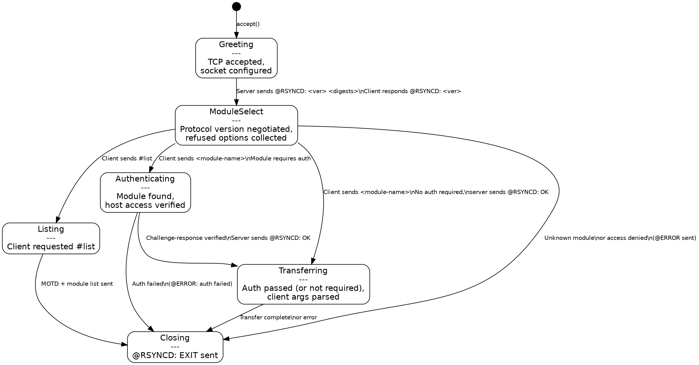
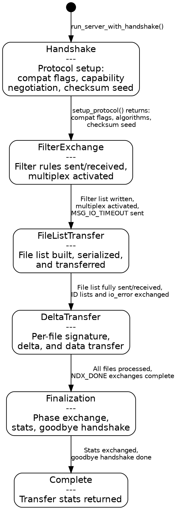
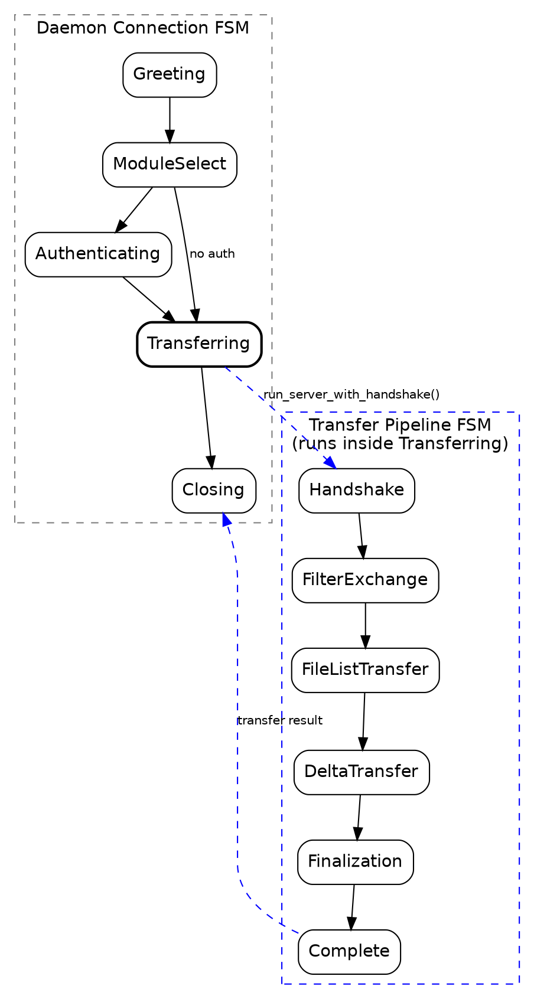

# Protocol FSM Reference (FSM-10)

Unified reference for the two protocol state machines that govern
oc-rsync's connection and transfer lifecycles. The daemon connection FSM
handles per-connection negotiation from TCP accept through module
selection and authentication. The transfer pipeline FSM handles the
data-transfer protocol from handshake through file list exchange, delta
transfer, and finalization. The two compose: the daemon FSM's
`Transferring` state wraps the transfer pipeline FSM.

## 1. Daemon Connection FSM

### 1.1 State Diagram (Graphviz)



### 1.2 ASCII State Diagram

```
           accept()
              |
              v
        +-----------+
        | Greeting  |  Server sends: @RSYNCD: 32.0 sha512 sha256 sha1 md5 md4
        +-----------+  Client sends: @RSYNCD: 32.0
              |
              v
       +--------------+
       | ModuleSelect |  Client sends module name, #list, or @RSYNCD: EXIT
       +--------------+
        /      |       \
       v       v        v
  +---------+ +----+ +----------------+
  | Listing | |ERR | | Authenticating |  Server sends: @RSYNCD: AUTHREQD <challenge>
  +---------+ +----+ +----------------+  Client sends: <user> <digest>
       |        |      /           \
       |        |     v             v
       |        |  +--------+    +-----+
       |        |  | Auth   |    | ERR |  @ERROR: auth failed on module <name>
       |        |  | Passed |    +-----+
       |        |  +--------+       |
       |        |     |             |
       |        |     v             |
       |        |  +--------------+ |
       |        |  | Transferring | |  Server sends: @RSYNCD: OK
       |        |  +--------------+ |  Transfer pipeline FSM runs here
       |        |     |             |
       v        v     v             v
       +---------------------------+
       |         Closing           |  Server sends: @RSYNCD: EXIT
       +---------------------------+
```

### 1.3 State Descriptions

#### Greeting

- **Entry condition:** TCP connection accepted, socket timeout set.
- **Actions:**
  - Server writes `@RSYNCD: <version>.<sub> <digest-list>\n` (cached per-process).
  - Client reads greeting, sends `@RSYNCD: <version>.<sub>\n`.
  - Client may also send `@RSYNCD: OPTION --<name>\n` lines for refused options.
  - Client may send `#early_input=<len>` followed by raw bytes.
- **Exit condition:** First non-`@RSYNCD:` line (or `#early_input`) received - this is the module name.
- **Error handling:** I/O error closes socket. Malformed version line is tolerated (line becomes module name).
- **Wire messages:** `@RSYNCD: 32.0 sha512 sha256 sha1 md5 md4\n` (server to client).
- **Upstream reference:** `clientserver.c:455` `output_daemon_greeting`.

#### ModuleSelect

- **Entry condition:** Protocol version negotiated, refused options collected, module name received.
- **Actions:**
  - If module name is `#list`, transition to Listing.
  - If module name is empty, send error and transition to Closing.
  - Look up module in configuration.
  - Check host-based access control (hosts allow/deny).
  - Acquire connection slot (`max connections` cap).
- **Exit condition:** Module found and accessible, or error.
- **Error handling:**
  - Unknown module: `@ERROR: Unknown module '<name>'\n` then `@RSYNCD: EXIT\n`.
  - Access denied: `@ERROR: access denied to <module> from <host> (<addr>)\n`.
  - Max connections reached: `@ERROR: max connections (<N>) reached -- try again later\n`.
- **Wire messages:** Conditional `@RSYNCD: CAP modules [authlist]\n` lines, then module-specific responses.
- **Upstream reference:** `clientserver.c:730-762` module lookup and access control.

#### Listing

- **Entry condition:** Client sent `#list`.
- **Actions:**
  - Write capability lines (`@RSYNCD: CAP modules [authlist]`).
  - Write MOTD lines.
  - Write module listing in `%-15s\t%s\n` format for each listable, accessible module.
- **Exit condition:** Module list sent, transitions to Closing.
- **Error handling:** I/O errors propagated.
- **Wire messages:** Capability lines, MOTD text, module lines, then `@RSYNCD: EXIT\n`.
- **Upstream reference:** `clientserver.c:1246-1254`.

#### Authenticating

- **Entry condition:** Module requires authentication (`auth users` configured).
- **Actions:**
  - Server generates a random challenge nonce.
  - Server sends `@RSYNCD: AUTHREQD <base64-challenge>\n`.
  - Client responds with `<username> <base64-digest>\n`.
  - Server verifies digest against secrets file using MD5 (protocol >= 30) or MD4 (protocol < 30).
- **Exit condition:** Authentication succeeds (transition to Transferring) or fails (transition to Closing).
- **Error handling:**
  - Missing response: `@ERROR: auth failed on module <name>\n`.
  - Bad credentials: same error message.
  - Missing secrets file: I/O error.
- **Wire messages:** `@RSYNCD: AUTHREQD <challenge>\n` (server), `<user> <digest>\n` (client).
- **Upstream reference:** `authenticate.c:auth_server()`, `compat.c:858`.

#### Transferring

- **Entry condition:** Module accessible (auth passed or not required).
- **Actions:**
  - Server sends `@RSYNCD: OK\n`.
  - Server reads client argument list (one arg per line, terminated by empty line).
  - Server validates module path, applies chroot/privilege restrictions.
  - Server invokes `run_server_with_handshake()` - this is where the **transfer pipeline FSM** runs.
- **Exit condition:** Transfer completes (success or error), transitions to Closing.
- **Error handling:**
  - Invalid module path: `@ERROR: module '<name>' path does not exist\n`.
  - Client path escapes module root: `@ERROR: <flag> path '<path>' is outside module root`.
  - Transfer errors propagated via multiplex `MSG_ERROR` frames.
- **Wire messages:** `@RSYNCD: OK\n` (server), then binary protocol (see transfer pipeline FSM).
- **Upstream reference:** `clientserver.c:rsync_module()` argument parsing and transfer dispatch.

#### Closing

- **Entry condition:** Any terminal event (listing complete, auth failure, transfer done, error).
- **Actions:**
  - Server sends `@RSYNCD: EXIT\n`.
  - Socket flushed and closed.
  - Connection slot released.
- **Exit condition:** Socket closed, thread exits.
- **Error handling:** Flush errors logged but not propagated.
- **Wire messages:** `@RSYNCD: EXIT\n` (server to client).
- **Upstream reference:** `clientserver.c` session cleanup.

### 1.4 Role-Specific Paths

The daemon FSM is server-only. Client-side daemon connections are handled by the
`daemon_transfer` module in `crates/core/src/client/remote/daemon_transfer/`, which
drives the client half of the same wire protocol:

| Phase | Server (daemon) | Client |
|-------|-----------------|--------|
| Greeting | Sends `@RSYNCD:` greeting | Reads greeting, sends version response |
| ModuleSelect | Reads module name | Sends `#list` or module name |
| Authenticating | Sends challenge, verifies response | Reads challenge, computes digest, sends response |
| Transferring | Reads client args, runs transfer engine | Sends args, runs transfer engine |
| Closing | Sends `@RSYNCD: EXIT` | Reads `@RSYNCD: EXIT` |

---

## 2. Transfer Pipeline FSM

### 2.1 State Diagram (Graphviz)



### 2.2 ASCII State Diagram

```
       run_server_with_handshake()
                  |
                  v
          +-------------+
          |  Handshake  |  Compat flags exchange (proto >= 30)
          |             |  Capability negotiation (checksum/compress)
          |             |  Checksum seed exchange (all protocols)
          +-------------+
                  |
                  v
        +-----------------+
        | FilterExchange  |  stdout flushed (raw mode ends)
        |                 |  Multiplex I/O activated
        |                 |  Filter list written (client mode)
        |                 |  MSG_IO_TIMEOUT sent (daemon server)
        +-----------------+
                  |
                  v
       +--------------------+
       | FileListTransfer   |  Input multiplex activated
       |                    |  Filter list received (server mode)
       |                    |  File list built and serialized
       |                    |  UID/GID lists sent (generator)
       |                    |  io_error flag sent (generator)
       +--------------------+
                  |
                  v
        +-----------------+
        | DeltaTransfer   |  Per-file transfer loop:
        |                 |    Generator: NDX requests, signatures, deltas
        |                 |    Receiver: token stream, delta apply, verify
        |                 |  INC_RECURSE: sub-lists sent lazily
        |                 |  Phase 1 (SHORT_SUM) -> Phase 2 (redo)
        +-----------------+
                  |
                  v
       +--------------------+
       |   Finalization     |  NDX_DONE exchanges per phase
       |                    |  NDX_DEL_STATS sent (proto >= 31)
       |                    |  Server stats written (sender)
       |                    |  Client stats received (receiver)
       |                    |  Goodbye handshake
       +--------------------+
                  |
                  v
          +-------------+
          |  Complete   |  ServerStats returned
          +-------------+
```

### 2.3 State Descriptions

#### Handshake

- **Entry condition:** `run_server_with_handshake()` called with `HandshakeResult` from daemon greeting or SSH version exchange.
- **Actions (upstream `compat.c:setup_protocol()`):**
  1. Compat flags exchange (protocol >= 30, upstream `compat.c:710-743`):
     - Server writes compat flags byte.
     - Client reads compat flags byte.
     - INC_RECURSE, VARINT_FLIST_FLAGS, and other capabilities negotiated.
  2. Capability negotiation (protocol >= 30, upstream `compat.c:534-585`):
     - Checksum algorithm selection (MD4, MD5, XXH3 via vstring).
     - Compression algorithm selection (zlib, zlibx, zstd, lz4 via vstring).
  3. Checksum seed exchange (all protocols, upstream `compat.c:750`):
     - Server writes 4-byte seed.
     - Client reads 4-byte seed.
- **Exit condition:** `SetupResult` produced with `compat_flags`, `negotiated_algorithms`, `checksum_seed`.
- **Error handling:** I/O errors or unsupported protocol versions abort the connection.
- **Wire messages:** 1-byte compat flags, vstring capability lines, 4-byte checksum seed.
- **Upstream reference:** `compat.c:572-644 setup_protocol()`.

#### FilterExchange

- **Entry condition:** Handshake complete, raw I/O flushed.
- **Actions:**
  - `stdout.flush()` - final raw-mode flush before multiplex wrapping.
  - `ServerWriter` wrapped with multiplex framing (protocol >= 23/30).
  - Client-mode sender writes filter rules via `write_filter_list()`.
  - Client-mode receiver may forward `--files-from` data.
  - Daemon server sends `MSG_IO_TIMEOUT` (protocol >= 31).
  - Batch recording initialized if applicable.
- **Exit condition:** All pre-transfer metadata exchanged, multiplex active.
- **Error handling:** Filter write errors or multiplex activation failures abort.
- **Wire messages:** Multiplex `MSG_DATA` frames wrapping filter rule bytes, `MSG_IO_TIMEOUT`.
- **Upstream reference:** `main.c:1249-1258`, `exclude.c:1650`.

#### FileListTransfer

- **Entry condition:** Multiplex active, filters exchanged.
- **Actions (role-specific):**
  - **Generator (sender side):**
    - Activates input multiplex.
    - Receives filter list from client (server mode).
    - Builds file list from paths, applies filter chain.
    - Serializes and sends file list entries (varint-encoded).
    - Sends UID/GID mapping lists.
    - Sends accumulated `io_error` flag.
    - With INC_RECURSE: partitions file list, sends initial segment; sub-lists sent lazily during delta.
  - **Receiver:**
    - Activates input multiplex.
    - Reads filter list (if server mode).
    - Receives and deserializes file list.
    - Sanitizes paths (symlink safety, path traversal checks).
    - With INC_RECURSE: receives initial segment; additional segments arrive during delta.
- **Exit condition:** Full file list transferred (or initial segment for INC_RECURSE).
- **Error handling:** Malformed file entries, path validation failures, I/O errors.
- **Wire messages:** Varint-encoded file entries (name, size, mtime, mode, uid, gid, etc.), NDX markers.
- **Upstream reference:** `flist.c:2192 send_file_list()`, `flist.c:2923 recv_file_list()`.

#### DeltaTransfer

- **Entry condition:** File list available, checksums configured.
- **Actions (role-specific):**
  - **Generator (sender side) - `send_files()` loop:**
    - Reads NDX requests from receiver (signature requests).
    - Opens basis file, computes rolling + strong checksums.
    - Generates delta tokens (COPY from basis, LITERAL for new data).
    - Sends token stream via multiplex.
    - With INC_RECURSE: sends sub-list file entries between delta responses.
  - **Receiver - token loop:**
    - Sends NDX request for each file needing transfer.
    - Reads token stream (COPY + LITERAL tokens).
    - Applies delta to basis file, writes to temp file.
    - Verifies whole-file checksum.
    - Renames temp file to destination (atomic commit).
    - Phase 1 uses `SHORT_SUM_LENGTH = 2` for block checksums.
    - Phase 2 (redo) uses `MAX_SUM_LENGTH = 16` for failed verifications.
  - **Both:**
    - NDX_DONE sent/received at segment and phase boundaries.
    - Metadata (permissions, timestamps, ownership) applied after data.
    - Delete operations executed (if `--delete` active).
- **Exit condition:** All files processed through all phases, final NDX_DONE exchanged.
- **Error handling:**
  - Checksum verification failure triggers phase 2 redo.
  - I/O errors on individual files logged via `MSG_ERROR`, transfer continues.
  - Fatal errors (disk full, permission denied on dest root) abort transfer.
- **Wire messages:** NDX file indices, signature blocks (`sum_head` + block checksums), token stream (COPY/LITERAL), `MSG_ERROR`/`MSG_INFO` frames.
- **Upstream reference:** `sender.c:send_files()`, `receiver.c:recv_files()`, `token.c:send_token()/recv_token()`.

#### Finalization

- **Entry condition:** All delta phases complete.
- **Actions:**
  - NDX_DONE exchange per phase boundary:
    - With INC_RECURSE: one NDX_DONE per segment, then per extra phase.
    - Without INC_RECURSE: alternating send/receive per phase.
  - NDX_DEL_STATS sent (protocol >= 31): 5 varints for delete counts by type.
  - Server-sender writes transfer statistics (bytes read/written/total size).
  - Client-receiver reads and parses transfer statistics.
  - Extended goodbye handshake (protocol >= 31):
    - `read_final_goodbye()` exchanges final NDX_DONE markers.
    - Both sides verify protocol state is clean.
- **Exit condition:** Stats exchanged, goodbye complete.
- **Error handling:** Unexpected NDX values during goodbye are protocol errors.
- **Wire messages:** NDX_DONE (-1), NDX_DEL_STATS (-3), 3x 8-byte stats (total_read, total_written, total_size).
- **Upstream reference:** `main.c:875-906 read_final_goodbye()`, `main.c:356-384 handle_stats()`.

#### Complete

- **Entry condition:** Finalization done.
- **Actions:** `ServerStats` (Receiver or Generator variant) returned to caller.
- **Exit condition:** Function returns.

### 2.4 Role-Specific Paths

The transfer pipeline is traversed by both the Generator (sender) and Receiver
roles, but each role performs different actions within each state:

| Phase | Generator (Sender) | Receiver |
|-------|-------------------|----------|
| Handshake | Writes compat flags, seed | Reads compat flags, seed |
| FilterExchange | Receives filter list (server) | Sends filter list (client) |
| FileListTransfer | Builds and sends file list | Receives and deserializes file list |
| DeltaTransfer | Reads NDX, sends deltas | Sends NDX, applies deltas |
| Finalization | Writes stats | Reads stats |

With INC_RECURSE enabled, the Generator interleaves sub-list segments
into the DeltaTransfer phase via `SegmentScheduler`, matching upstream
`sender.c:227,261` cadence.

---

## 3. FSM Composition

The daemon connection FSM and transfer pipeline FSM compose at the
`Transferring` state. The daemon FSM owns the connection lifecycle; when
it enters `Transferring`, it hands the socket (wrapped in a
`BufReader<DaemonStream>`) plus the negotiated protocol version to
`run_server_with_handshake()`, which drives the transfer pipeline FSM
to completion.



### 3.1 Data Flow at the Composition Boundary

The daemon FSM accumulates negotiation state that the transfer pipeline
FSM consumes:

| Daemon FSM produces | Transfer pipeline FSM consumes |
|---------------------|-------------------------------|
| `ProtocolVersion` (from `@RSYNCD:` exchange) | `HandshakeResult.protocol` |
| Client arguments (arg-per-line after `@RSYNCD: OK`) | `ServerConfig` fields |
| Authenticated user (from challenge-response) | `ServerConfig.connection.auth_user` |
| Bandwidth limiter (from daemon config) | `ServerConfig.connection.bandwidth_*` |
| Module path and permissions | `ServerConfig.args`, `ServerConfig.write.*` |
| Early input data | `ServerConfig.connection.early_input` |
| Daemon filter rules (from module config) | `ServerConfig.daemon_filter_rules` |

The `HandshakeResult` struct bridges the boundary. In daemon mode, the
`@RSYNCD:` text protocol has already exchanged protocol versions, so
`HandshakeResult.compat_exchanged = false` (compat flags are exchanged
in binary during the transfer pipeline's Handshake state, not during the
daemon greeting). The `HandshakeResult.client_args` carries the
verbatim argument list parsed from the post-OK lines.

### 3.2 SSH Mode (No Daemon FSM)

For SSH transfers, the daemon connection FSM is not involved. The CLI
spawns an SSH subprocess and connects directly to the transfer pipeline
FSM:

```
CLI -> SSH subprocess -> remote oc-rsync --server
                              |
                              v
                    Transfer Pipeline FSM
                    (Handshake starts with binary 4-byte version exchange)
```

The `HandshakeResult` in SSH mode has `client_args = None` and the
binary version exchange happens in the Handshake state via
`perform_handshake()` in `crates/transfer/src/handshake.rs`.

---

## 4. Error Handling Summary

### 4.1 Daemon Connection FSM Errors

| State | Error | Wire response | Exit code |
|-------|-------|---------------|-----------|
| Greeting | I/O error | Socket closed | 10 (SOCKET_IO) |
| ModuleSelect | Unknown module | `@ERROR: Unknown module` | 5 (SELECT) |
| ModuleSelect | Access denied | `@ERROR: access denied` | 5 (SELECT) |
| ModuleSelect | Max connections | `@ERROR: max connections reached` | 5 (SELECT) |
| Authenticating | Bad credentials | `@ERROR: auth failed` | 5 (SELECT) |
| Authenticating | Missing secrets | I/O error | 10 (SOCKET_IO) |
| Transferring | Transfer error | `MSG_ERROR` multiplex frame | varies |
| Transferring | Module path missing | `@ERROR: path does not exist` | 5 (SELECT) |

### 4.2 Transfer Pipeline FSM Errors

| State | Error | Recovery | Exit code |
|-------|-------|----------|-----------|
| Handshake | Unsupported protocol | Abort | 2 (PROTOCOL) |
| Handshake | Compat flags mismatch | Abort | 2 (PROTOCOL) |
| FilterExchange | Multiplex activation | Abort | 12 (STREAM) |
| FileListTransfer | Malformed entry | Abort | 12 (STREAM) |
| FileListTransfer | Path traversal | Skip file | 23 (PARTIAL) |
| DeltaTransfer | Checksum mismatch | Redo in phase 2 | - |
| DeltaTransfer | Per-file I/O error | Log, continue | 23 (PARTIAL) |
| DeltaTransfer | Disk full | Abort | 11 (IO) |
| Finalization | Unexpected NDX | Protocol error | 12 (STREAM) |
| Finalization | Goodbye timeout | Abort | 30 (TIMEOUT) |

---

## 5. Implementation Mapping

### 5.1 Daemon Connection FSM

The daemon connection lifecycle is implemented as implicit function-call
ordering in `crates/daemon/src/daemon/sections/session_runtime.rs`
(`handle_legacy_session`). The `SessionState` enum in
`crates/daemon/src/daemon/session_registry.rs` provides an
observability mirror for admin/stats views.

| FSM State | Implementation location |
|-----------|------------------------|
| Greeting | `greeting.rs::cached_legacy_daemon_greeting()` |
| ModuleSelect | `session_runtime.rs:237-276` (version/option loop) |
| Listing | `module_access/listing.rs::respond_with_module_list()` |
| Authenticating | `module_access/authentication.rs::perform_module_authentication()` |
| Transferring | `module_access/transfer.rs` -> `run_server_with_handshake()` |
| Closing | `LegacyMessageCache::write_exit()` |

### 5.2 Transfer Pipeline FSM

The transfer pipeline lifecycle is driven by `run_server_with_handshake()`
in `crates/transfer/src/lib.rs`. Each phase is a linear function call
sequence, with role dispatch at the DeltaTransfer boundary.

| FSM State | Implementation location |
|-----------|------------------------|
| Handshake | `setup/mod.rs::setup_protocol_with()` |
| FilterExchange | `lib.rs:468-532` (flush, multiplex, filters, IO timeout) |
| FileListTransfer | Generator: `generator/transfer/orchestrator.rs::run()` |
| | Receiver: `receiver/transfer/setup.rs::setup_transfer()` |
| DeltaTransfer | Generator: `generator/transfer/orchestrator.rs::run_transfer_loop()` |
| | Receiver: `receiver/transfer/pipeline/` (token loop) |
| Finalization | Receiver: `receiver/transfer/phases.rs::exchange_phase_done()` |
| | Generator: `generator/transfer/orchestrator.rs` (stats + goodbye) |
| Complete | `lib.rs:554-574` (return `ServerStats`) |

### 5.3 Type-State and Runtime Mirrors

The codebase has both compile-time type-state and runtime enum
representations for protocol phases:

| Pattern | Location | Scope |
|---------|----------|-------|
| Type-state | `protocol/src/state/typestate.rs` `ProtocolState<P>` | Protocol lifecycle tracking |
| Type-state | `compress/src/strategy/type_state.rs` `NegotiationPipeline<S>` | Compression negotiation |
| Runtime enum | `protocol/src/state/dynamic.rs` `DynamicProtocolState` | Non-generic contexts |
| Runtime enum | `daemon/session_registry.rs` `SessionState` | Observability (DashMap) |

See `docs/design/type-state-protocol-phases.md` for the evaluation of
extending type-state to the daemon connection and transfer setup phases.

---

## 6. Wire Protocol Quick Reference

### 6.1 Daemon Protocol Messages

All daemon-phase messages are line-oriented ASCII, terminated by `\n`:

| Message | Direction | Format |
|---------|-----------|--------|
| Version greeting | S -> C | `@RSYNCD: <ver>.<sub> <digest1> <digest2> ...\n` |
| Version response | C -> S | `@RSYNCD: <ver>.<sub>\n` |
| Refused option | C -> S | `@RSYNCD: OPTION --<name>\n` |
| Capability | S -> C | `@RSYNCD: CAP <flags>\n` |
| Auth challenge | S -> C | `@RSYNCD: AUTHREQD <base64-nonce>\n` |
| Auth response | C -> S | `<username> <base64-digest>\n` |
| Module request | C -> S | `<module-name>\n` |
| Module list | C -> S | `#list\n` |
| Early input | C -> S | `#early_input=<len>\n` + `<len>` raw bytes |
| OK | S -> C | `@RSYNCD: OK\n` |
| Error | S -> C | `@ERROR: <message>\n` |
| Exit | S -> C | `@RSYNCD: EXIT\n` |

### 6.2 Transfer Protocol Messages

After `@RSYNCD: OK`, the protocol switches to binary framing:

| Data | Format | Phase |
|------|--------|-------|
| Compat flags | 1 byte (protocol >= 30) | Handshake |
| Capability vstrings | Length-prefixed strings | Handshake |
| Checksum seed | 4 bytes LE i32 | Handshake |
| Filter rules | Varint-length + rule bytes | FilterExchange |
| MSG_IO_TIMEOUT | Multiplex frame (code 22) + 4 bytes | FilterExchange |
| File entries | Varint-encoded fields | FileListTransfer |
| NDX index | Varint (1-4 bytes) | DeltaTransfer |
| Signature block | `sum_head` + checksum array | DeltaTransfer |
| Token stream | COPY (offset+len) / LITERAL (data) | DeltaTransfer |
| NDX_DONE | Varint -1 | Finalization |
| NDX_DEL_STATS | Varint -3 + 5 varints | Finalization |
| Transfer stats | 3 x 8-byte counts | Finalization |

---

## 7. References

- `crates/daemon/src/daemon/sections/session_runtime.rs` - Daemon connection lifecycle
- `crates/daemon/src/daemon/sections/greeting.rs` - `@RSYNCD:` greeting builder
- `crates/daemon/src/daemon/sections/module_access/` - Module lookup, auth, transfer
- `crates/daemon/src/daemon/session_registry.rs` - `SessionState` observability enum
- `crates/transfer/src/lib.rs` - `run_server_with_handshake()` transfer orchestration
- `crates/transfer/src/setup/mod.rs` - Protocol setup (compat flags, capabilities, seed)
- `crates/transfer/src/handshake.rs` - SSH binary version exchange
- `crates/transfer/src/receiver/transfer/phases.rs` - Phase exchange and goodbye
- `crates/transfer/src/generator/transfer/orchestrator.rs` - Generator transfer loop
- `crates/protocol/src/state/typestate.rs` - Compile-time protocol state machine
- `crates/protocol/src/state/dynamic.rs` - Runtime protocol state machine
- `docs/design/type-state-protocol-phases.md` - Type-state evaluation (#2134)
- `docs/design/typestate-protocol-negotiation.md` - Negotiation type-state evaluation
- Upstream `clientserver.c` - Daemon connection handling
- Upstream `compat.c:setup_protocol()` - Protocol setup
- Upstream `sender.c:send_files()` - Generator transfer loop
- Upstream `receiver.c:recv_files()` - Receiver transfer loop
- Upstream `main.c:read_final_goodbye()` - Finalization handshake
